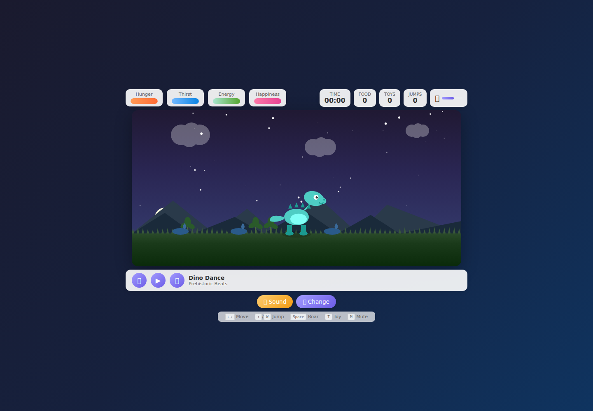

# Dyno Simulator

A browser-based dinosaur pet simulator. Pick a color and size, then explore a day/night world while managing hunger, thirst, energy, and happiness. The game includes food, toys, jumping, roaring, sound effects, and a music player.



## Run locally

No dependencies or build step are required. From the repository root, run:

```sh
python3 -m http.server 8000
```

Open <http://localhost:8000/> in a browser. You can also open `index.html` directly.

## Play

Choose a body color and size, then select **Start Simulation!**. Use **←/→** to move, **↑** or **W** to jump, **Space** to roar, **T** to choose a toy, and **M** to mute. On-screen buttons provide touch controls. Use **Change** to return to dinosaur creation and **Restart** to reset the simulation.

## Project structure

All markup, styles, canvas rendering, and game logic live in `index.html`; there are no external packages.
